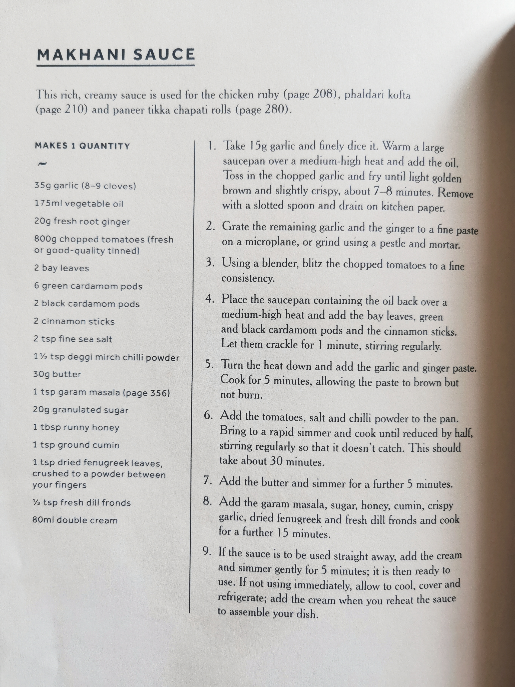

# Makhani Sauce

This rich, creamy sauce is used for the chicken ruby (page 208), and paneer tikka chapati rolls (page 280).

Tags: indian, sauce
Time: 15 mins prep | 60 mins cook

## Ingredients

- 15g garlic (cloves)
- 175ml vegetable oil
- 20g fresh root ginger
- 800g chopped tomatoes, (fresh or good-quality tinned)
- 2 bay leaves
- 6 green cardamom pods
- 2 black cardamom pods
- 2 cinnamon sticks
- 2 tsp fine sea salt
- 1.5 tsp desgiri mirch chilli powder
- 30g garam masala
- 1 tsp honey
- 1 tsp ground cumin
- 1 tsp dried fenugreek leaves, crushed to a powder between your fingers
- 0.5 tsp fresh dill fronds
- 80ml double cream

## Method

1. Take 15g and finely dice it. Warm a large saucepan over a medium-high heat and add the oil.

2. Toss in the chopped garlic and fry until light golden brown and slightly crisp, about 7–8 minutes. Remove a slotted spoon and drain on kitchen paper.

3. Grate the remaining garlic and ginger to a fine paste on a microplane, or grind using a pestle and mortar.

4. Place the saucepan containing the oil back over a medium-high heat and add the bay leaves, green and black cardamom pods and the cinnamon sticks. Let them crackle for 1 minute, stirring regularly.

5. Turn the heat down and add the garlic and ginger paste. Cook for 5 minutes, allowing the paste to brown without burn.

6. Add the tomatoes, salt and chilli powder to the pan. Bring to a rapid simmer and cook until reduced by half, stirring regularly so it doesn’t catch. This should take about 30 minutes.

7. Add the butter and simmer for a further 5 minutes.

8. Add the garam masala, sugar, honey, cumin, crispy garlic, dried fenugreek and fresh dill fronds and cook for a further 15 minutes.

9. If the sauce is to be used straight away, add the cream and simmer gently for 5 minutes; it is then ready to use. If not using immediately, allow to cool, cover and refrigerate; add the cream when you reheat the sauce to assemble your dish.
